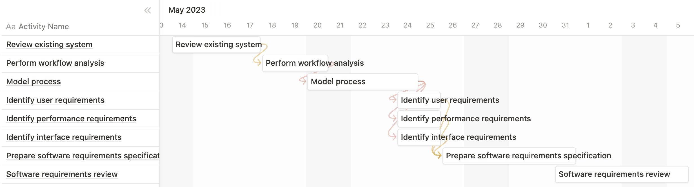

# Project Estimation - FUTURE

Date:

Version:

# Estimation approach

Consider the EZWallet project in FUTURE version (as proposed by the team), assume that you are going to develop the project INDEPENDENT of the deadlines of the course

# Estimate by size

###

|                                                                                                         | Estimate |
| ------------------------------------------------------------------------------------------------------- | -------- |
| NC = Estimated number of classes to be developed                                                        |          |
| A = Estimated average size per class, in LOC                                                            |          |
| S = Estimated size of project, in LOC (= NC \* A)                                                       |          |
| E = Estimated effort, in person hours (here use productivity 10 LOC per person hour)                    |          |
| C = Estimated cost, in euro (here use 1 person hour cost = 30 euro)                                     |          |
| Estimated calendar time, in calendar weeks (Assume team of 4 people, 8 hours per day, 5 days per week ) |          |

# Estimate by product decomposition

###

| Component name        | Estimated effort  |
| --------------------- | ----------------- |
| Requirement document  | 40 person hour    |
| GUI prototype         | 75 person hour    |
| Design document       | 40 person hour    |
| Code                  | 180 person hour   |
| Unit tests            | 58 person hour    |
| Api tests             | 58 person hour    |
| Management documents  | 40 person hour    |
| --------------------- | ----------------- |
| Total                 | 491 person hour   |

# Estimate by activity decomposition

###

| Activity name                               | Estimated effort (person hours) |
| ------------------------------------------- | ------------------------------- |
| Review existing systems                     | 61                              |
| Perform workflow analysis                   | 61                              |
| Model process                               | 53                              |
| Identify user requirements                  | 53                              |
| Identify performance requirements           | 53                              |
| Identify interface requirements             | 53                              |
| Prepare software requirements specification | 77                              |
| Software requirements review                | 61                              |

Insert here Gantt chart with above activities

# Summary

Report here the results of the three estimation approaches. The estimates may differ. Discuss here the possible reasons for the difference

|                                    | Estimated effort | Estimated duration |
| ---------------------------------- | ---------------- | ------------------ |
| estimate by size                   |                  |
| estimate by product decomposition  | 491              | 123                |
| estimate by activity decomposition | 472              | 118                |
